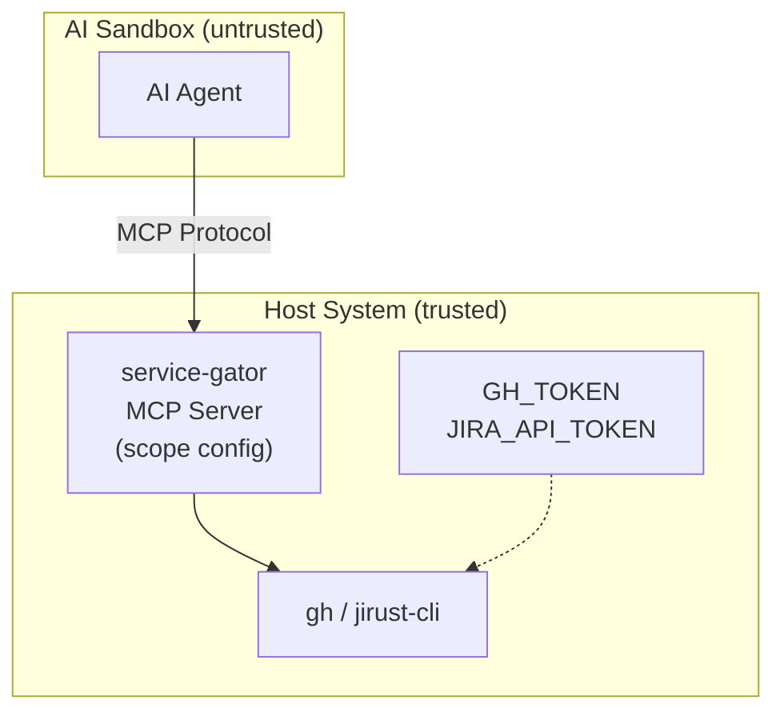

# service-gator

A [Model Context Protocol (MCP)](https://modelcontextprotocol.io/) server that provides scope-restricted access to external services for AI agents.

## Overview

service-gator is an MCP server that exposes tools for interacting with GitHub, GitLab, Forgejo/Gitea, JIRA, and other services while enforcing fine-grained access control. It's designed for sandboxed AI agents that need controlled access to services where PAT/token-based authentication grants overly broad privileges.

### The Problem

Personal access tokens are difficult to manage securely for AI agents:

- **JIRA** PATs grant *all* privileges of the human user with no scoping
- **GitHub** PATs offer some scoping, but as the [github-mcp-server docs note](https://github.com/github/github-mcp-server?tab=readme-ov-file#token-security-best-practices): tokens are static, easily over-privileged, and you can't scope a token to specific repositories at creation time

For agentic AI workloads, we need fine-grained and *dynamic* credential scoping that tokens alone cannot provide.

### The Solution

service-gator runs **outside** the AI agent's sandbox as an MCP server. The agent connects via MCP protocol and can only perform operations allowed by your scope configuration—even though the underlying CLI tools have full access via their tokens.

### MCP Tools

The server exposes the following tools:

| Tool | Description |
|------|-------------|
| `gh` | Execute GitHub REST API commands (read-only `gh api <endpoint> [--jq]`) |
| `gh_pending_review` | Create, update, and delete pending PR reviews (for AI code review workflows) |
| `gl` | Execute GitLab REST API commands (read-only `glab api <endpoint> [--jq]`) |
| `forgejo` | Execute Forgejo/Gitea REST API commands (read-only, wraps `tea`) |
| `jira` | Execute JIRA CLI commands within configured scopes |

### Key Features

- **Scope-based access control**: Define which repositories/projects an agent can access
- **Fine-grained permissions**: Separate read, create-draft, pending-review, and write permissions
- **Resource-level grants**: Grant write access to specific PRs/issues dynamically
- **Security boundary**: Agent cannot bypass restrictions—it must go through the MCP server

## Installation

```bash
cargo install service-gator
```

Or build from source:

```bash
git clone https://github.com/cgwalters/service-gator
cd service-gator
cargo build --release
```

## Quick Start

### 1. Configure credentials (on the host, NOT in the sandbox)

```bash
export GH_TOKEN="ghp_xxxxxxxxxxxx"         # GitHub personal access token
export GITLAB_TOKEN="glpat_xxxxxxxxxxxx"   # GitLab personal access token (for glab)
export FORGEJO_TOKEN="xxxxxxxxxxxx"        # Forgejo/Gitea token (for tea)
export JIRA_API_TOKEN="xxxxxxxxxx"         # JIRA API token (for jirust-cli)
```

### 2. Start the MCP server

For simple cases, use inline configuration—no config file needed:

```bash
# Single repo with read access
GH_TOKEN="ghp_xxx" service-gator --mcp-server 127.0.0.1:8080 \
  --gh-repo myorg/myrepo:read

# Multiple repos with different permissions
service-gator --mcp-server 127.0.0.1:8080 \
  --gh-repo myorg/myrepo:read,create-draft \
  --gh-repo myorg/other:read \
  --jira-project MYPROJ:read
```

Credentials are passed via environment variables (`GH_TOKEN`, `JIRA_API_TOKEN`)—either exported beforehand or inline as shown above.

For complex configurations, use a config file (see [Configuration](#configuration) below).

### 3. Connect your AI agent

The agent (running in a sandbox) connects to `http://host-ip:8080/mcp` using the MCP protocol. It can only perform operations allowed by your scope config.

**Security note**: The MCP server must run **outside** the sandbox. Running service-gator inside the sandbox provides no security benefit since the agent could simply run `gh` or `jirust-cli` directly.

### Inline Configuration Options

| Flag | Format | Example |
|------|--------|---------|
| `--gh-repo` | `OWNER/REPO:PERMS` | `--gh-repo myorg/repo:read,create-draft` |
| `--gitlab-project` | `GROUP/PROJECT:PERMS` | `--gitlab-project mygroup/project:read` |
| `--gitlab-host` | `HOSTNAME` | `--gitlab-host gitlab.example.com` |
| `--forgejo-host` | `HOSTNAME` | `--forgejo-host codeberg.org` (required) |
| `--forgejo-repo` | `OWNER/REPO:PERMS` | `--forgejo-repo user/repo:read` |
| `--jira-project` | `PROJECT:PERMS` | `--jira-project MYPROJ:read,create` |
| `--scope` | JSON | `--scope '{"gh":{"repos":{"o/r":{"read":true}}}}'` |
| `--no-config-file` | (flag) | Skip loading `~/.config/service-gator.toml` |

**GitHub permissions**: `read`, `create-draft`, `pending-review`, `write`

**GitLab permissions**: `read`, `create-draft`, `approve`, `write`

**Forgejo permissions**: `read`, `create-draft`, `pending-review`, `write`

**JIRA permissions**: `read`, `create`, `write`

Inline options are merged with the config file (inline takes precedence). Use `--no-config-file` to ignore the config file entirely.

## Configuration

Create `~/.config/service-gator.toml`:

```toml
# GitHub repository permissions
[gh.repos]
# Read-only access to all repos under an owner
"owner/*" = { read = true }

# Read + create draft PRs for a specific repo
"owner/repo" = { read = true, create-draft = true }

# Read + manage pending PR reviews (for AI code review)
"owner/reviewed-repo" = { read = true, pending-review = true }

# Full write access
"owner/trusted-repo" = { read = true, create-draft = true, pending-review = true, write = true }

# PR-specific grants (typically set dynamically)
[gh.prs]
"owner/repo#42" = { read = true, write = true }

# JIRA project permissions
[jira.projects]
"MYPROJ" = { read = true, create = true }
"OTHER" = { read = true }

# JIRA issue-specific grants
[jira.issues]
"MYPROJ-123" = { read = true, write = true }

# GitLab project permissions
[gitlab.projects]
"mygroup/*" = { read = true }
"mygroup/myproject" = { read = true, create-draft = true, approve = true }

# GitLab MR-specific grants (use ! separator)
[gitlab.mrs]
"mygroup/myproject!42" = { read = true, write = true }

# Optional: self-hosted GitLab
[gitlab]
host = "gitlab.example.com"

# Forgejo/Gitea (multiple instances supported via [[forgejo]] array)
[[forgejo]]
host = "codeberg.org"

[forgejo.repos]
"myuser/myrepo" = { read = true, create-draft = true }

[[forgejo]]
host = "git.example.com"

[forgejo.repos]
"team/*" = { read = true, write = true }
```

### Permission Levels

**GitHub (`gh`):**
- `read`: View PRs, issues, code, run status, etc.
- `create-draft`: Create draft PRs only (safer for review workflows)
- `pending-review`: Create, update, and delete pending PR reviews (see below)
- `write`: Full access (merge, close, create non-draft PRs, etc.)

**GitLab (`gl`):**
- `read`: View MRs, issues, code, pipelines, etc.
- `create-draft`: Create draft/WIP MRs only
- `approve`: Approve/unapprove MRs
- `write`: Full access (merge, close, create non-draft MRs, etc.)

**Forgejo/Gitea (`forgejo`):**
- `read`: View PRs, issues, code, etc.
- `create-draft`: Create draft PRs only
- `pending-review`: Create and manage pending PR reviews
- `write`: Full access

**JIRA (`jira`):**
- `read`: View issues, projects, search
- `create`: Create new issues
- `write`: Full access (update, transition, comment, etc.)

### Pattern Matching

Repository patterns support trailing wildcards:
- `owner/repo`: Exact match
- `owner/*`: All repos under `owner`

More specific patterns take precedence over wildcards.

## Tool Reference

### `gh` — GitHub REST API

Wraps the [GitHub CLI](https://cli.github.com/). Provides read-only access to the GitHub REST API.

- Only `gh api <endpoint>` is supported
- All requests forced to GET method (read-only)
- Only `--jq` option allowed for filtering output
- Repository extracted from API path (e.g., `/repos/owner/repo/...`)

### `gh_pending_review` — Pending PR Reviews

A tool for AI agents to create code reviews that require human approval before publishing.

**Operations:**
- **Create**: Creates a review in PENDING state with inline comments
- **Update**: Modify the review body (only pending reviews)
- **Delete**: Remove a pending review before submission
- **List/Get**: View existing reviews

**Security features:**

1. **Marker token**: All reviews include a marker comment (`<!-- service-gator-review -->`). The agent can only update/delete reviews containing this marker, preventing manipulation of human-created reviews.

2. **Pending state only**: Reviews are always created in PENDING state. The agent cannot submit (approve/request changes)—a human must review and submit via the GitHub UI.

3. **No submit/dismiss**: The `/events` and `/dismissals` endpoints are blocked.

Designed for workflows like [perform-forge-review](https://github.com/bootc-dev/agent-skills) where an AI agent prepares a code review for human approval.

### `gl` — GitLab REST API

Wraps the [GitLab CLI (glab)](https://gitlab.com/gitlab-org/cli). Provides read-only access to the GitLab REST API.

- Only `glab api <endpoint>` is supported
- All requests forced to GET method (read-only)
- Only `--jq` option allowed for filtering output
- Project extracted from API path (e.g., `/projects/group%2Fproject/...`)
- Supports self-hosted GitLab via `--gitlab-host` or config

### `forgejo` — Forgejo/Gitea REST API

Wraps the [tea CLI](https://gitea.com/gitea/tea). Provides read-only access to Forgejo and Gitea instances.

- Only `tea api <endpoint>` is supported
- All requests forced to GET method (read-only)
- Repository extracted from API path (e.g., `/api/v1/repos/owner/repo/...`)
- Supports multiple Forgejo/Gitea hosts

### `jira` — JIRA CLI

Wraps [jirust-cli](https://github.com/ilpianista/jirust-cli). Provides project-scoped access to JIRA.

- Project-based access control
- Issue key parsing (e.g., `PROJ-123`)
- Command classification for all major operations

## Security Model



The MCP server creates a security boundary. The sandboxed agent:
- Cannot access the host filesystem (no config file tampering)
- Cannot read environment variables (no credential theft)
- Cannot execute arbitrary binaries (no bypassing service-gator)

All requests go through the MCP server which enforces scope restrictions before invoking the underlying CLI tools.

## License

Licensed under either of:

- Apache License, Version 2.0 ([LICENSE-APACHE](LICENSE-APACHE) or http://www.apache.org/licenses/LICENSE-2.0)
- MIT license ([LICENSE-MIT](LICENSE-MIT) or http://opensource.org/licenses/MIT)

at your option.

## Roadmap

See [docs/todo.md](docs/todo.md) for planned features and improvements.

## Contributing

Contributions are welcome! Please feel free to submit a Pull Request.
