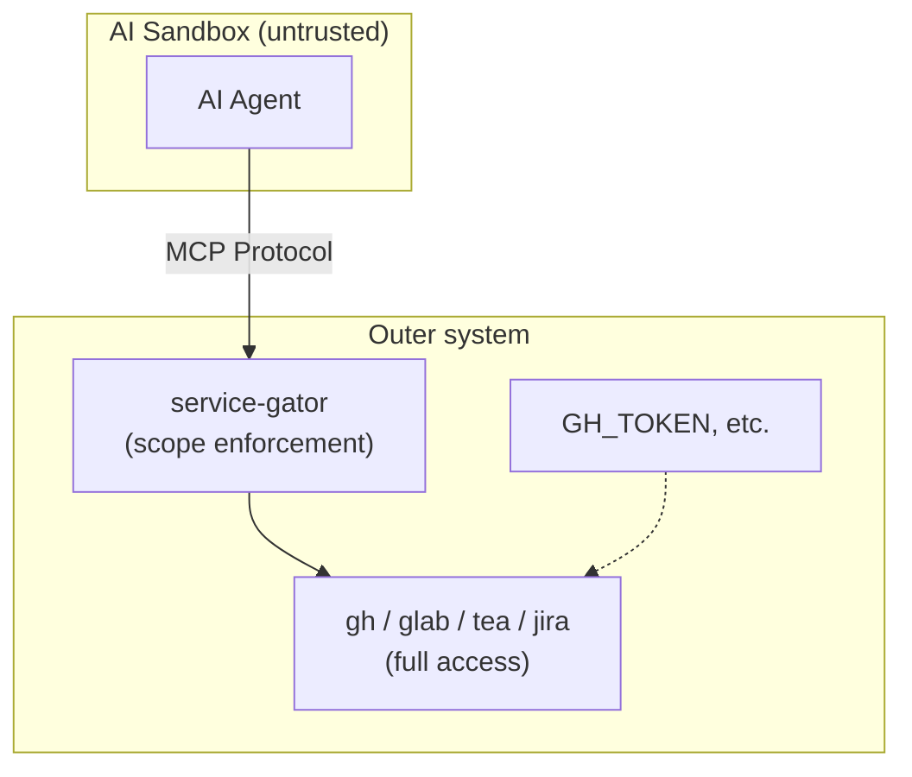

# service-gator

A [Model Context Protocol (MCP)](https://modelcontextprotocol.io/) server that provides scope-restricted access to external services for AI agents.

## Overview

service-gator is an MCP server that exposes tools for interacting with GitHub, GitLab, Forgejo/Gitea, and JIRA while enforcing fine-grained access control. It's designed for sandboxed AI agents that need controlled access to services where PAT/token-based authentication grants overly broad privileges.

### The Problem

Personal access tokens are difficult to manage securely for AI agents:

- **JIRA** PATs grant *all* privileges of the human user with no scoping
- **GitHub** PATs offer some scoping, but as the [github-mcp-server docs note](https://github.com/github/github-mcp-server?tab=readme-ov-file#token-security-best-practices): tokens are static, easily over-privileged, and you can't scope a token to specific repositories at creation time

### The Solution

service-gator runs **outside** the AI agent's sandbox as an MCP server. The agent connects via MCP protocol and can only perform operations allowed by the scope configuration—even though the underlying CLI tools have full access via their tokens.

## Quick Start

The recommended deployment is the container image with CLI-based scope configuration:

```bash
# Single repo with read access
# Note: GITHUB_TOKEN is also accepted as an alternative to GH_TOKEN
podman run --rm -p 8080:8080 \
  -e GH_TOKEN \
  ghcr.io/lobstertrap/service-gator:latest \
  --mcp-server 0.0.0.0:8080 \
  --gh-repo myorg/myrepo:read

# Multiple repos with different permissions
podman run --rm -p 8080:8080 \
  -e GH_TOKEN -e JIRA_API_TOKEN \
  ghcr.io/lobstertrap/service-gator:latest \
  --mcp-server 0.0.0.0:8080 \
  --gh-repo myorg/myrepo:read,push-new-branch,create-draft \
  --gh-repo myorg/other:read \
  --gh-repo user/fork:read,push-new-branch \
  --jira-project MYPROJ:read
```

The agent (running in a sandbox) connects to `http://host-ip:8080/mcp` using the MCP protocol.

### Benefits of the New Permission Model

The separation of `push-new-branch` and `create-draft` permissions provides several key advantages:

1. **Precise Access Control**: Grant exactly the permissions needed for each repository
2. **Workflow Flexibility**: Support complex development workflows (fork-based contributions, automated deployments, etc.)
3. **Security by Design**: Prevent accidental operations by requiring explicit permission grants
4. **Clear Tool Mapping**: Each tool has well-defined permission requirements

#### Common Workflows Enabled

**Open Source Contribution:**
- Agent pushes to user's fork (`push-new-branch` on fork)
- Agent creates PRs on upstream repo (`create-draft` on upstream)
- Upstream maintainers review and merge without agent having write access to upstream

**Enterprise Development:**
- Agent has full access to feature branches (`push-new-branch` + `create-draft` on main repo)
- Agent can read but not modify production repos (`read` only)
- Automated deployment agents have precise permissions per environment

**Code Review Assistant:**
- Agent can create draft PRs for review (`create-draft` only)
- Agent cannot push arbitrary branches (no `push-new-branch`)
- Human reviewers control what gets merged

#### Migration from Legacy Configurations

**Existing configurations continue to work** - no immediate action required. However, to take advantage of the new permission model:

1. **Audit current permissions**: Review which repositories need branch push vs PR creation access
2. **Add explicit `push-new-branch`**: Specify `push-new-branch = true` where Git operations are needed
3. **Separate concerns**: Use different permissions for different repositories based on their role
4. **Test thoroughly**: Verify that agents have the expected access in your workflow

**Example migration:**
```bash
# Before (legacy)
--gh-repo myorg/repo:read,create-draft

# After (explicit) 
--gh-repo myorg/repo:read,push-new-branch,create-draft

# Or separate by role
--gh-repo myorg/repo:read,push-new-branch      # For direct commits  
--gh-repo upstream/repo:read,create-draft  # For PR creation only
```

### CLI Options

| Flag | Format | Example |
|------|--------|---------|
| `--gh-repo` | `OWNER/REPO:PERMS` | `--gh-repo myorg/repo:read,push-new-branch,create-draft` |
| `--gitlab-project` | `GROUP/PROJECT:PERMS` | `--gitlab-project mygroup/project:read` |
| `--gitlab-host` | `HOSTNAME` | `--gitlab-host gitlab.example.com` |
| `--forgejo-host` | `HOSTNAME` | `--forgejo-host codeberg.org` |
| `--forgejo-repo` | `REPO:PERMS` | `--forgejo-repo owner/repo:read` |
| `--jira-project` | `PROJECT:PERMS` | `--jira-project MYPROJ:read,create` |
| `--scope` | JSON | `--scope '{"gh":{"repos":{"o/r":{"read":true}}}}'` |
| `--scope-file` | PATH | `--scope-file /etc/service-gator/scopes.json` |

#### Permission Examples

**Fork-based development workflow:**
```bash
# Allow branch pushing to user's fork, PR creation on upstream repo
podman run --rm -p 8080:8080 \
  -e GH_TOKEN \
  ghcr.io/lobstertrap/service-gator:latest \
  --mcp-server 0.0.0.0:8080 \
  --gh-repo upstream/project:read,create-draft \
  --gh-repo user/project:read,push-new-branch
```

**Full development access:**
```bash
# Both branch operations and PR creation on the same repo
podman run --rm -p 8080:8080 \
  -e GH_TOKEN \
  ghcr.io/lobstertrap/service-gator:latest \
  --mcp-server 0.0.0.0:8080 \
  --gh-repo myorg/project:read,push-new-branch,create-draft
```

**Review-only agent:**
```bash
# Can create draft PRs but cannot push branches
podman run --rm -p 8080:8080 \
  -e GH_TOKEN \
  ghcr.io/lobstertrap/service-gator:latest \
  --mcp-server 0.0.0.0:8080 \
  --gh-repo myorg/project:read,create-draft
```

### Permissions

**GitHub**: `read`, `push-new-branch`, `create-draft`, `pending-review`, `write`

**GitLab**: `read`, `push-new-branch`, `create-draft`, `approve`, `write`

**Forgejo**: `read`, `push-new-branch`, `create-draft`, `pending-review`, `write`

**JIRA**: `read`, `create`, `write`

#### Permission Details

- **`read`**: Read repository content, issues, PRs, etc.
- **`push-new-branch`**: Push Git branches (create/update refs) - required for all Git push operations
- **`create-draft`**: Create draft PRs/MRs on the hosting platform (independent of branch operations)
- **`pending-review`**: Manage pending PR reviews
- **`write`**: Full write access (implies all other permissions)

#### Permission Independence

The key innovation in service-gator's permission model is the clean separation between:

- **Git operations** (`push-new-branch`): Creating and updating branches in repositories
- **Platform operations** (`create-draft`): Creating PRs, MRs, and other platform-specific resources

This separation enables flexible workflows:
- Push to user forks while restricting PR creation to upstream repos
- Create PRs on upstream repos without allowing arbitrary branch pushing
- Grant precise permissions based on the agent's role and trust level

#### Fork-Only Push Restrictions (New)

All services now support a `require-fork` option that restricts push operations to forked repositories only. This is useful for ensuring agents can only push to user forks, not original repositories:

```toml
[gh.repos]
"upstream/repo" = { create-draft = true, require-fork = true }

[gitlab.projects] 
"group/project" = { create-draft = true, require-fork = true }

[[forgejo]]
host = "codeberg.org"
[forgejo.repos]
"owner/repo" = { create-draft = true, require-fork = true }
```

When `require-fork = true`:
- **GitHub**: Checks if repository has `"fork": true` via GitHub API
- **GitLab**: Checks for `"forked_from_project"` field via GitLab API  
- **Forgejo**: Checks if repository has `"fork": true` via Forgejo API

If the target repository is not a fork, push operations will be rejected with an error message including a link to fork the repository.

## Configuration Examples

### TOML Configuration Format

service-gator supports TOML configuration files for complex permission setups. Use `--scope-file config.toml` to load configuration from a file.

#### Example 1: Fork-based Development Workflow

This configuration allows agents to push branches to user forks while restricting PR creation to upstream repositories:

```toml
# config.toml
[gh.repos]
# Upstream repository - can create PRs but cannot push branches
"upstream/project" = { read = true, create-draft = true }

# User's fork - can push branches but cannot create PRs  
"user/project" = { read = true, push-new-branch = true }

# Documentation repo - read-only access
"upstream/docs" = { read = true }
```

**Use case:** An AI agent working on contributions to open source projects. It can:
- Push feature branches to the user's fork
- Create draft PRs on the upstream repository (referencing the fork branches)
- Cannot accidentally push branches to upstream repositories
- Cannot create PRs on the user's fork (avoiding confusion)

#### Example 2: Team Development with Branch Protection

```toml
[gh.repos]
# Main development repo - full access for team members
"company/product" = { 
    read = true, 
    push-new-branch = true, 
    create-draft = true, 
    pending-review = true 
}

# Staging repo - can push branches but not create PRs (automated deployments)
"company/staging" = { read = true, push-new-branch = true }

# Production repo - read-only with PR creation for releases
"company/production" = { read = true, create-draft = true }
```

#### Example 3: Multi-forge Setup

```toml
# GitHub repositories
[gh.repos]
"myorg/repo" = { read = true, push-new-branch = true, create-draft = true }
"upstream/repo" = { read = true, create-draft = true }

# GitLab repositories  
[gitlab.projects]
"group/project" = { read = true, push-new-branch = true }
"public/project" = { read = true }

# Forgejo/Codeberg repositories
[[forgejo]]
host = "codeberg.org"
[forgejo.repos] 
"user/project" = { read = true, push-new-branch = true, create-draft = true }

# JIRA projects
[jira.projects]
"PROJ" = { read = true, create = true }
```

#### Example 4: Backward Compatibility

Existing configurations continue to work. The `create-draft` permission maintains backward compatibility for Git push operations:

```toml
# Legacy configuration - still works
[gh.repos]
"myorg/legacy-repo" = { read = true, create-draft = true, pending-review = true }

# Mixed configuration - explicit separation
[gh.repos] 
"myorg/new-repo" = { read = true, push-new-branch = true, create-draft = true }
```

**Note:** While legacy configurations work, explicit `push-new-branch` permissions are recommended for clarity and to take advantage of the flexible permission model.

### Advanced Fork Restrictions

Combine the new permission model with fork restrictions for maximum security:

```toml
[gh.repos]
# Upstream - can create PRs, push operations must use forks
"upstream/repo" = { 
    read = true, 
    create-draft = true, 
    push-new-branch = true,
    require-fork = true 
}

# User fork - unrestricted push access
"user/repo" = { read = true, push-new-branch = true }
```

This configuration ensures that:
- Agents can create PRs on the upstream repository
- Any push operations to the upstream repository are rejected unless it's a fork
- Push operations to the user's fork work normally
- The agent cannot accidentally push directly to upstream, even if it has `push-new-branch` permission

## Container Secrets (Recommended)

**Use `podman secret` instead of `-e GH_TOKEN`** for production deployments:

- Secrets don't appear in `podman inspect` or process listings
- Secrets are stored encrypted by podman
- Secrets can be managed separately from container configuration

service-gator reads `*_FILE` environment variables at startup and exports them to the environment for child processes.

### Podman

```bash
# Create secrets (one-time setup)
echo -n "ghp_xxxx" | podman secret create gh_token -
echo -n "my-jwt-secret" | podman secret create sg_secret -

# Run with secrets
podman run --rm -p 8080:8080 \
  --secret gh_token \
  --secret sg_secret \
  -e GH_TOKEN_FILE=/run/secrets/gh_token \
  -e SERVICE_GATOR_SECRET_FILE=/run/secrets/sg_secret \
  ghcr.io/lobstertrap/service-gator:latest \
  --mcp-server 0.0.0.0:8080 \
  --gh-repo myorg/myrepo:read
```

Supported `*_FILE` variables: `GH_TOKEN_FILE`, `GITLAB_TOKEN_FILE`, `FORGEJO_TOKEN_FILE`, `GITEA_TOKEN_FILE`, `JIRA_API_TOKEN_FILE`, `SERVICE_GATOR_SECRET_FILE`, `SERVICE_GATOR_ADMIN_KEY_FILE`

### Kubernetes

service-gator is designed for Kubernetes deployments with:

- **`/healthz` endpoint** for liveness/readiness probes
- **SIGTERM handling** for graceful pod termination
- **`--scope-file`** with live reload via inotify (for ConfigMap-based configuration)
- **`*_FILE` environment variables** for secret volume mounts

#### Basic Deployment

```yaml
apiVersion: v1
kind: Pod
metadata:
  name: service-gator
spec:
  containers:
  - name: service-gator
    image: ghcr.io/lobstertrap/service-gator:latest
    args:
    - --mcp-server
    - 0.0.0.0:8080
    - --gh-repo
    - myorg/myrepo:read
    ports:
    - containerPort: 8080
    livenessProbe:
      httpGet:
        path: /healthz
        port: 8080
      initialDelaySeconds: 5
      periodSeconds: 10
    readinessProbe:
      httpGet:
        path: /healthz
        port: 8080
      initialDelaySeconds: 2
      periodSeconds: 5
    env:
    - name: GH_TOKEN
      valueFrom:
        secretKeyRef:
          name: service-gator-secrets
          key: gh-token
---
apiVersion: v1
kind: Secret
metadata:
  name: service-gator-secrets
type: Opaque
stringData:
  gh-token: "ghp_xxxx"
```

#### Dynamic Scopes with ConfigMap (Recommended)

For runtime scope updates without pod restarts, use `--scope-file` with a ConfigMap:

```yaml
apiVersion: v1
kind: ConfigMap
metadata:
  name: service-gator-scopes
data:
  scopes.json: |
    {
      "scopes": {
        "gh": {
          "repos": {
            "myorg/myrepo": {"read": true, "push-new-branch": true}
          }
        }
      }
    }
---
apiVersion: apps/v1
kind: Deployment
metadata:
  name: service-gator
spec:
  replicas: 1
  selector:
    matchLabels:
      app: service-gator
  template:
    metadata:
      labels:
        app: service-gator
    spec:
      containers:
      - name: service-gator
        image: ghcr.io/lobstertrap/service-gator:latest
        args:
        - --mcp-server
        - 0.0.0.0:8080
        - --scope-file
        - /etc/service-gator/scopes.json
        ports:
        - containerPort: 8080
        livenessProbe:
          httpGet:
            path: /healthz
            port: 8080
        volumeMounts:
        - name: scopes
          mountPath: /etc/service-gator
        - name: gh-token
          mountPath: /run/secrets
        env:
        - name: GH_TOKEN_FILE
          value: /run/secrets/gh-token
      volumes:
      - name: scopes
        configMap:
          name: service-gator-scopes
      - name: gh-token
        secret:
          secretName: service-gator-secrets
```

When you update the ConfigMap, service-gator automatically reloads the scopes (via inotify) without requiring a pod restart. This enables orchestrators like [devaipod](https://github.com/cgwalters/devaipod) to dynamically grant repository access to running agents.

## Dynamic Reconfiguration

For runtime scope updates, **`--scope-file` with ConfigMap is the recommended approach** (see Kubernetes section above). The file is watched via inotify and reloaded automatically when changed.

This enables orchestrators like [devaipod](https://github.com/cgwalters/devaipod) to dynamically grant repository access: `devaipod context add <pod> https://github.com/org/repo` updates the ConfigMap, and service-gator picks up the change immediately.

### Legacy: JWT Tokens

> **Note:** JWT-based dynamic scopes are soft-deprecated in favor of `--scope-file`. The file-based approach is simpler, doesn't require secret management for JWT signing, and integrates better with Kubernetes patterns.

JWT tokens are still supported for cases where per-request scope embedding is needed:

<details>
<summary>JWT Token Usage (click to expand)</summary>

```bash
# Start server with JWT auth enabled
podman run --rm -p 8080:8080 \
  -e GH_TOKEN \
  -e SERVICE_GATOR_SECRET="your-256-bit-secret" \
  -e SERVICE_GATOR_ADMIN_KEY="admin-secret" \
  ghcr.io/lobstertrap/service-gator:latest \
  --mcp-server 0.0.0.0:8080 \
  --scope '{"server":{"mode":"required"}}'
```

#### Mint a Token

```bash
curl -X POST http://localhost:8080/admin/mint-token \
  -H "Content-Type: application/json" \
  -H "X-Admin-Key: admin-secret" \
  -d '{
    "scopes": {
      "gh": { 
        "repos": { 
          "myorg/myrepo": { 
            "read": true, 
            "push-new-branch": true, 
            "create-draft": true 
          }
        } 
      }
    },
    "expires-in": 3600
  }'
# Returns: {"token": "eyJhbG...", "expires-at": 1706283600}
```

#### Use the Token

The agent includes the token in MCP requests:

```
Authorization: Bearer eyJhbG...
```

#### Token Rotation

Tokens can self-rotate (refresh) without admin intervention:

```bash
curl -X POST http://localhost:8080/token/rotate \
  -H "Authorization: Bearer eyJhbG..." \
  -H "Content-Type: application/json" \
  -d '{"expires-in": 3600}'
```

</details>

## MCP Tools

| Tool | Required Permissions | Description |
|------|---------------------|-------------|
| `status` | None | Overall status of all services including authentication status and available tools |
| `gh` | `read` | GitHub REST API (read-only `gh api <endpoint> [--jq]`) |
| `gh_pending_review` | `pending-review` | Pending PR reviews for AI code review workflows |
| `gh_create_branch` | `push-new-branch` | Create agent branches (enforced `agent-` prefix) |
| `gh_update_pr_head` | `push-new-branch` or `write` | Update a PR's branch by PR number |
| `github_push` (branch only) | `push-new-branch` | Push branch without creating PR (`create_draft_pr=false`) |
| `github_push` (with PR) | `push-new-branch` + `create-draft` | Push branch and create draft PR (`create_draft_pr=true`) |
| `git_push_local` | `push-new-branch` | Push local commits from agent workspace to remote |
| `gl` | `read` | GitLab REST API (read-only `glab api <endpoint> [--jq]`) |
| `forgejo` | `read` | Forgejo/Gitea REST API (read-only, wraps `tea`) |
| `jira` | Varies by operation | JIRA CLI within configured scopes |

### Git Push for Sandboxed Agents

The `git_push_local`, `gh_create_branch`, and `gh_update_pr_head` tools enable sandboxed AI agents to push commits without having git credentials inside the sandbox.

**Setup requirements:**
- The agent needs workspace access with a git clone of the repository
- service-gator needs `push-new-branch` permission for Git push operations
- service-gator needs `create-draft` permission for PR/MR creation (if using GitHub/GitLab push tools with PR creation)
- The `git_push_local` tool takes the repo path as a parameter (must be under `/workspaces`)

**Permission requirements by tool:**
- `git_push_local`: Requires `push-new-branch` permission only
- `github_push` with `create_draft_pr=false`: Requires `push-new-branch` permission only  
- `github_push` with `create_draft_pr=true`: Requires both `push-new-branch` and `create-draft` permissions
- `gh_create_branch`: Requires `push-new-branch` permission only
- `gh_update_pr_head`: Requires `push-new-branch` or `write` permission

**Security model:** The agent's repository is untrusted—it may contain malicious hooks or config. The `git_push_local` tool uses a safe pattern: it creates a trusted temporary clone, fetches objects from the agent's repo using `--reference` (which only transfers objects, never executes hooks), then pushes from the trusted clone. Branch creation is restricted to an `agent-` prefix to prevent agents from modifying protected branches.

**Fork restrictions:** To further limit where agents can push, configure `require-fork = true` in the repository permissions. This ensures agents can only push to forked repositories, preventing accidental pushes to upstream repositories.

## Security Model



The sandboxed agent:
- Cannot access the host filesystem
- Cannot read environment variables containing credentials
- Cannot execute arbitrary binaries
- Must go through service-gator which enforces scope restrictions

Here the "outer system" could be anything, but a good way to do
this is e.g. distinct containers (or a host system with a containerized
agent), etc.

## Installation

### Container (recommended)

```bash
podman pull ghcr.io/lobstertrap/service-gator:latest
```

### From source

```bash
cargo install service-gator
```

Requires `gh`, `glab`, and `tea` to be installed separately.

## License

Licensed under either Apache License 2.0 or MIT license, at your option.

## Contributing

Contributions are welcome! Please feel free to submit a Pull Request.
