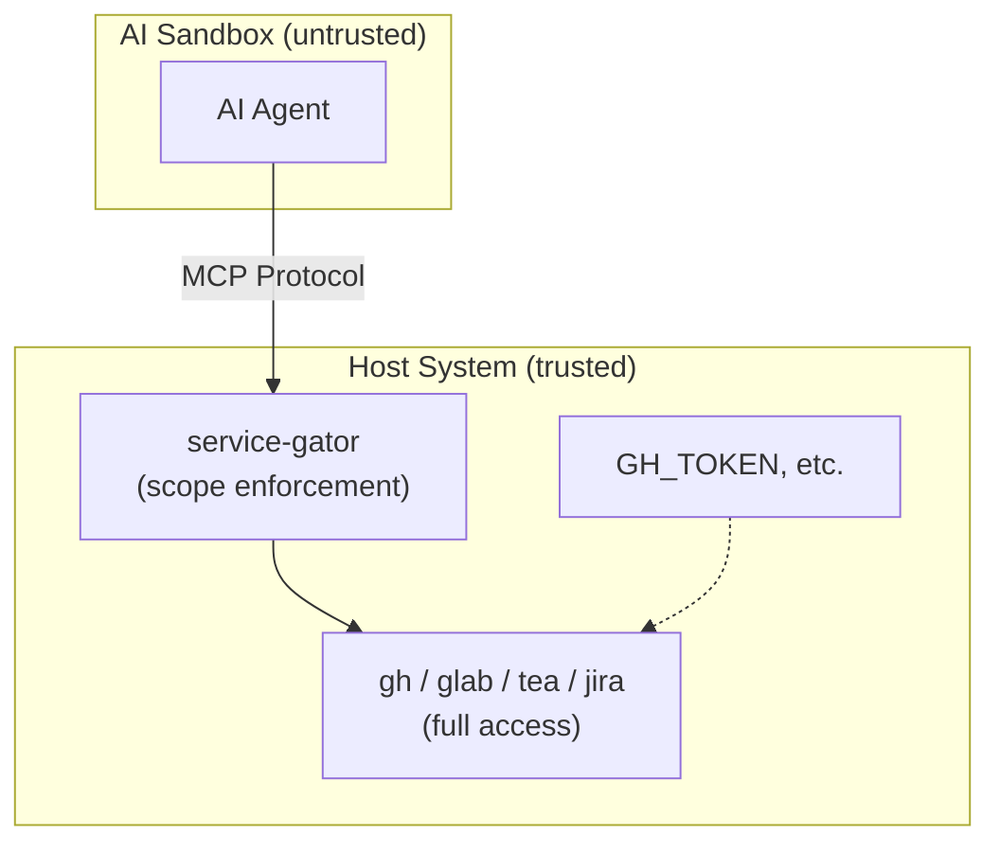

# service-gator

A [Model Context Protocol (MCP)](https://modelcontextprotocol.io/) server that provides scope-restricted access to external services for AI agents.

## Overview

service-gator is an MCP server that exposes tools for interacting with GitHub, GitLab, Forgejo/Gitea, and JIRA while enforcing fine-grained access control. It's designed for sandboxed AI agents that need controlled access to services where PAT/token-based authentication grants overly broad privileges.

### The Problem

Personal access tokens are difficult to manage securely for AI agents:

- **JIRA** PATs grant *all* privileges of the human user with no scoping
- **GitHub** PATs offer some scoping, but as the [github-mcp-server docs note](https://github.com/github/github-mcp-server?tab=readme-ov-file#token-security-best-practices): tokens are static, easily over-privileged, and you can't scope a token to specific repositories at creation time

### The Solution

service-gator runs **outside** the AI agent's sandbox as an MCP server. The agent connects via MCP protocol and can only perform operations allowed by the scope configuration—even though the underlying CLI tools have full access via their tokens.

## Quick Start

The recommended deployment is the container image with CLI-based scope configuration:

```bash
# Single repo with read access
podman run --rm -p 8080:8080 \
  -e GH_TOKEN \
  ghcr.io/cgwalters/service-gator:latest \
  --mcp-server 0.0.0.0:8080 \
  --gh-repo myorg/myrepo:read

# Multiple repos with different permissions
podman run --rm -p 8080:8080 \
  -e GH_TOKEN -e JIRA_API_TOKEN \
  ghcr.io/cgwalters/service-gator:latest \
  --mcp-server 0.0.0.0:8080 \
  --gh-repo myorg/myrepo:read,create-draft \
  --gh-repo myorg/other:read \
  --jira-project MYPROJ:read
```

The agent (running in a sandbox) connects to `http://host-ip:8080/mcp` using the MCP protocol.

### CLI Options

| Flag | Format | Example |
|------|--------|---------|
| `--gh-repo` | `OWNER/REPO:PERMS` | `--gh-repo myorg/repo:read,create-draft` |
| `--gitlab-project` | `GROUP/PROJECT:PERMS` | `--gitlab-project mygroup/project:read` |
| `--gitlab-host` | `HOSTNAME` | `--gitlab-host gitlab.example.com` |
| `--forgejo-host` | `HOSTNAME` | `--forgejo-host codeberg.org` |
| `--forgejo-repo` | `REPO:PERMS` | `--forgejo-repo owner/repo:read` |
| `--jira-project` | `PROJECT:PERMS` | `--jira-project MYPROJ:read,create` |
| `--scope` | JSON | `--scope '{"gh":{"repos":{"o/r":{"read":true}}}}'` |

### Permissions

**GitHub**: `read`, `create-draft`, `pending-review`, `write`

**GitLab**: `read`, `create-draft`, `approve`, `write`

**Forgejo**: `read`, `create-draft`, `pending-review`, `write`

**JIRA**: `read`, `create`, `write`

## Container Secrets (Recommended)

**Use `podman secret` instead of `-e GH_TOKEN`** for production deployments:

- Secrets don't appear in `podman inspect` or process listings
- Secrets are stored encrypted by podman
- Secrets can be managed separately from container configuration

service-gator reads `*_FILE` environment variables at startup and exports them to the environment for child processes.

### Podman

```bash
# Create secrets (one-time setup)
echo -n "ghp_xxxx" | podman secret create gh_token -
echo -n "my-jwt-secret" | podman secret create sg_secret -

# Run with secrets
podman run --rm -p 8080:8080 \
  --secret gh_token \
  --secret sg_secret \
  -e GH_TOKEN_FILE=/run/secrets/gh_token \
  -e SERVICE_GATOR_SECRET_FILE=/run/secrets/sg_secret \
  ghcr.io/cgwalters/service-gator:latest \
  --mcp-server 0.0.0.0:8080 \
  --gh-repo myorg/myrepo:read
```

Supported `*_FILE` variables: `GH_TOKEN_FILE`, `GITLAB_TOKEN_FILE`, `FORGEJO_TOKEN_FILE`, `JIRA_API_TOKEN_FILE`, `SERVICE_GATOR_SECRET_FILE`, `SERVICE_GATOR_ADMIN_KEY_FILE`

### Kubernetes

```yaml
apiVersion: v1
kind: Pod
metadata:
  name: service-gator
spec:
  containers:
  - name: service-gator
    image: ghcr.io/cgwalters/service-gator:latest
    args:
    - --mcp-server
    - 0.0.0.0:8080
    - --gh-repo
    - myorg/myrepo:read
    ports:
    - containerPort: 8080
    env:
    - name: GH_TOKEN
      valueFrom:
        secretKeyRef:
          name: service-gator-secrets
          key: gh-token
    - name: SERVICE_GATOR_SECRET
      valueFrom:
        secretKeyRef:
          name: service-gator-secrets
          key: jwt-secret
    - name: SERVICE_GATOR_ADMIN_KEY
      valueFrom:
        secretKeyRef:
          name: service-gator-secrets
          key: admin-key
---
apiVersion: v1
kind: Secret
metadata:
  name: service-gator-secrets
type: Opaque
stringData:
  gh-token: "ghp_xxxx"
  jwt-secret: "your-256-bit-secret"
  admin-key: "your-admin-key"
```

## Multi-Tenant Deployment with JWT Tokens

For multi-tenant deployments, use JWT tokens to provide per-agent scoping. A single service-gator instance can serve multiple agents, each with different access:

```bash
# Start server with JWT auth enabled
podman run --rm -p 8080:8080 \
  -e GH_TOKEN \
  -e SERVICE_GATOR_SECRET="your-256-bit-secret" \
  -e SERVICE_GATOR_ADMIN_KEY="admin-secret" \
  ghcr.io/cgwalters/service-gator:latest \
  --mcp-server 0.0.0.0:8080 \
  --scope '{"server":{"mode":"required"}}'
```

### Mint a Token

```bash
curl -X POST http://localhost:8080/admin/mint-token \
  -H "Content-Type: application/json" \
  -H "X-Admin-Key: admin-secret" \
  -d '{
    "scopes": {
      "gh": { "repos": { "myorg/myrepo": { "read": true } } }
    },
    "expires-in": 3600
  }'
# Returns: {"token": "eyJhbG...", "expires-at": 1706283600}
```

### Use the Token

The agent includes the token in MCP requests:

```
Authorization: Bearer eyJhbG...
```

### Token Rotation

Tokens can self-rotate (refresh) without admin intervention:

```bash
curl -X POST http://localhost:8080/token/rotate \
  -H "Authorization: Bearer eyJhbG..." \
  -H "Content-Type: application/json" \
  -d '{"expires-in": 3600}'
```

## MCP Tools

| Tool | Description |
|------|-------------|
| `gh` | GitHub REST API (read-only `gh api <endpoint> [--jq]`) |
| `gh_pending_review` | Pending PR reviews for AI code review workflows |
| `gl` | GitLab REST API (read-only `glab api <endpoint> [--jq]`) |
| `forgejo` | Forgejo/Gitea REST API (read-only, wraps `tea`) |
| `jira` | JIRA CLI within configured scopes |

## Security Model



The sandboxed agent:
- Cannot access the host filesystem
- Cannot read environment variables containing credentials
- Cannot execute arbitrary binaries
- Must go through service-gator which enforces scope restrictions

## Configuration File (Optional)

For complex configurations, create `~/.config/service-gator.toml`:

```toml
[gh.repos]
"owner/*" = { read = true }
"owner/repo" = { read = true, create-draft = true }

[jira.projects]
"MYPROJ" = { read = true, create = true }

[gitlab.projects]
"mygroup/*" = { read = true }

[[forgejo]]
host = "codeberg.org"

[forgejo.repos]
"user/repo" = { read = true }
```

CLI options are merged with (and take precedence over) the config file.

## Installation

### Container (recommended)

```bash
podman pull ghcr.io/cgwalters/service-gator:latest
```

### From source

```bash
cargo install service-gator
```

Requires `gh`, `glab`, and `tea` to be installed separately.

## License

Licensed under either Apache License 2.0 or MIT license, at your option.

## Contributing

Contributions are welcome! Please feel free to submit a Pull Request.
